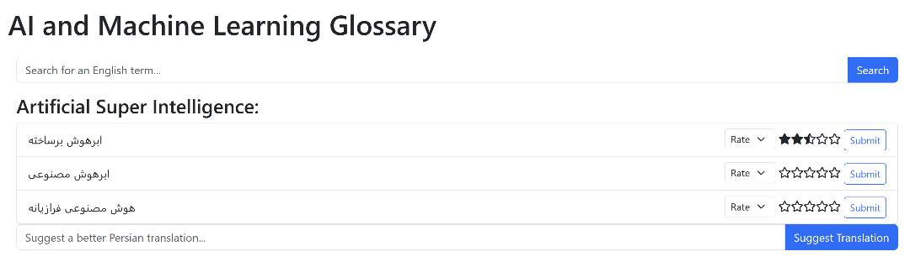

# Persian-AI-and-Machine-Learning-Glossary

## Introduction

Welcome to the Persian AI and Machine Learning Glossary repository! This project aims to provide a comprehensive and up-to-date collection of Persian translations for technical terms and concepts in the field of artificial intelligence and machine learning. Our goal is to facilitate better communication and understanding of these complex topics for Persian-speaking learners, researchers, and practitioners.

## Purpose

This repository serves as a collaborative platform for the AI and machine learning community to share, discuss, and refine translations of technical terms and concepts in Persian. By creating a centralized glossary, we hope to standardize terminology and improve the accessibility of resources for Persian speakers in this rapidly evolving domain.

## How to Use

You can use this glossary as a reference when reading or writing about AI and machine learning in Persian. To find a translation for a specific term, simply browse the repository or use the search functionality to locate the term and its corresponding Persian translation.

### Glossary Files

The glossary is available in the following formats:

- `Glossary.yaml`: The main glossary file containing terms and their translations in no particular order.
- `Glossary_sorted_en.yaml`: The glossary sorted alphabetically by English terms.
- `Glossary_sorted_fa.yaml`: The glossary sorted alphabetically by Persian terms.

## Contributing

We welcome contributions from the community! You can contribute to this project by visiting the deployed web app and following these steps. Your contributions will help make this glossary more comprehensive and valuable for the Persian-speaking AI and machine learning community.

1. **Rating existing translations**: Browse the dictionary and rate the translations you find. Your ratings will help improve the quality of the translations shown in future searches.

2. **Adding new translations for existing terms**: If you find a term that has no translation or you believe you can provide a better translation, please feel free to add your suggestion. Your contribution will be reviewed, and if approved, it will be added to the dictionary.

3. **Adding new terms and their corresponding translations**: If you come across a term that is not present in the dictionary, you can add the term along with its translation. Your submission will be reviewed, and if approved, it will be added to the dictionary.

To get started, visit the [deployed web app](your_web_app_link_here) and start contributing. Thank you for your support!

When suggesting a new term or translation, please ensure that it is relevant to the field of AI and machine learning, and that the translation is accurate and clear. We appreciate your help in maintaining the quality and consistency of the glossary.

## Feedback and Suggestions

If you have any questions, feedback, or suggestions, please feel free to open an issue or reach out to us through the repository's discussions section. We value your input and look forward to collaborating with you on this project.

**Let's work together to make AI and machine learning more accessible to the Persian-speaking community!**

## License

This project is licensed under the MIT License. You are free to share and adapt the material for any purpose, even commercially, as long as you give appropriate credit, provide a link to the license, and indicate if changes were made. See the [LICENSE](LICENSE) file for more information.
